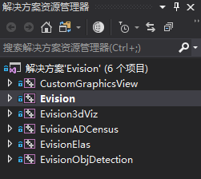
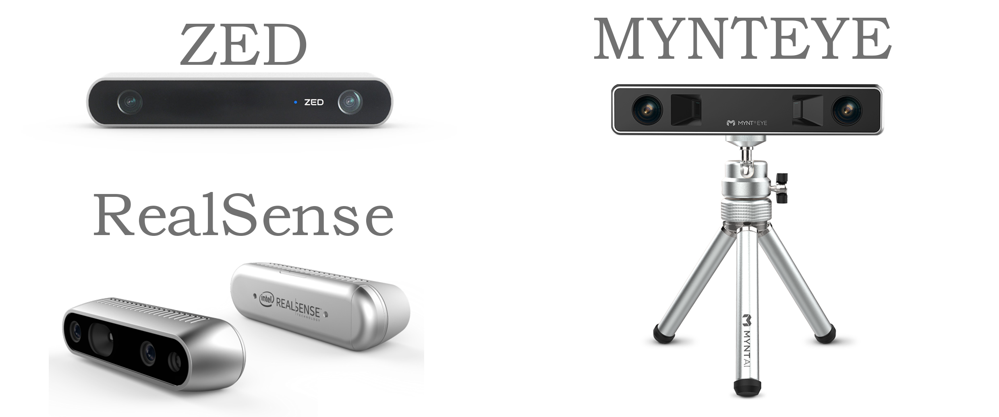
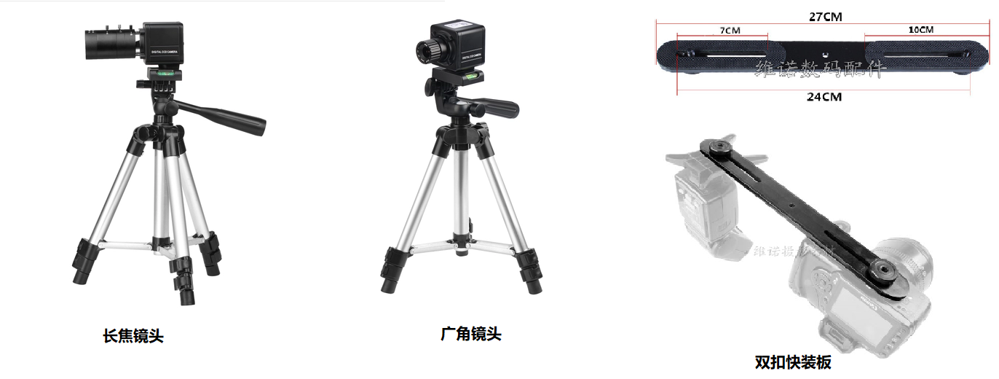

Evision 双目视觉系统

<a href="https://www.bilibili.com/video/av46024738">演示视频</a>

Introduction:
=========

1. 双目系统的标定,畸变校正,视差,三维重建,距离测量等. 
2. 基于Yolo的实时目标检测. 
3. ELAS,ADCensus视差算法. 
4. 关于双目的中文资料重复度太高,希望各位后来者能够吸取前人精华,摒弃前人的糟粕,多多自行探索,不要抄来抄去 
5. 如果您对于Visual Studio和Qt Creater并不是十分熟悉,请务必仔细阅读本文档. 
6. 如果您需要安装依赖,请仔细阅读本文下方的安装指南,从官方网站下载安装包,并且不要按照其他形如"OpenCV和VS2017环境搭建"之类的教程进行所谓的环境配置. 
7. 项目中自带了OpenCV,请不要修改项目的"包含目录,库目录和附加依赖项"等项目,除非您非常清楚这些东西的意义. 
8.  关于程序使用方面的问题,可以联系邮件jiafeng5513@outlook.com,有关课程设计和毕业论文(Windows程序开发,机器视觉,深度学习,图像处理)也可以联系作者 

目录
=========
- [Introduction:](#introduction)
- [目录](#%E7%9B%AE%E5%BD%95)
      - [1.Dependencies](#1dependencies)
      - [2.Installation_guide](#2installationguide)
      - [3.Directory_specification](#3directoryspecification)
      - [4.Solutions_and_projects](#4solutionsandprojects)
      - [6.Evision(C++/Qt版本)](#6evisioncqt%E7%89%88%E6%9C%AC)
      - [7.CvLabMain和CvLabSandbox(C#版本)](#7cvlabmain%E5%92%8Ccvlabsandboxc%E7%89%88%E6%9C%AC)
      - [8.双目设备](#8%E5%8F%8C%E7%9B%AE%E8%AE%BE%E5%A4%87)
      - [9.参考文献](#9%E5%8F%82%E8%80%83%E6%96%87%E7%8C%AE)
      - [10.部分框图](#10%E9%83%A8%E5%88%86%E6%A1%86%E5%9B%BE)

#### 1.Dependencies
1. Qt :5.12.0
2. OpenCV : 3.4.5
3. Visual Studio 2017
4. 可选依赖
   1. cudnn(不使用CUDNN不影响任何功能)
   2. PCL 1.9.1(不使用PCL,将不能使用Evision3dViz和保存点云的功能)
   3. VTK 8.1.0 with QVTKWidget(不使用VTK,将不能使用Evision3dViz)
   4. CUDA 10.0(不使用CUDA,将无法使用目标检测模块)
   5. NVIDIA GTX 1060同级别或更高级,理论上也支持NVIDIA更老的显卡(如果没有NVIDIA显卡,将无法安装CUDA和CUDNN)

#### 2.Installation_guide

1. [Qt安装指南](./doc/Qt_Install.md) 
2. [VS2017安装指南](./doc/VS2017_Install.md) 
3. [VS2017-Qt配置指南](./doc/qt_vs_config.md) 
4. [CUDA和GPU支持安装指南](./doc/cuda_install.md) 

#### 3.Directory_specification
1. `data`文件夹存储测试用例 
2. `doc`文件夹中存储的是文档和文档中所用的图片等资源. 
3. `package`文件夹存储项目所需的依赖 
4. `props`中存储的是属性表
5. `scripts`文件夹存储编译脚本,由于使用了VisualStudio宏,这些脚本不能直接运行,此外还有用于生成一些模式化代码的python脚本. 
6. `src`文件夹中存放工程目录和解决方案文件. 

#### 4.Solutions_and_projects
* 用VS2017打开`src/Evision.sln`,你将看到其中含有使用6个工程: 

1. CustomGraphicsView是自定义QtDesigner插件. 
2. Evision是Qt版的Evision主程序,生成目标是exe. 
3. Evision3dViz是点云模块,提供3维点云的观看和一些其他操作,依赖PCL和VTK. 
4. EvisionADCensus是ADCensus视差算法模块. 
5. EvisionElas是Elas视差算法模块. 
6. EvisionObjDetection是目标检测模块,依赖CUDA. 
* 用VS2017打开`src/CvLib.sln`,你将会看到两个工程: 

1. CvLabMain是用WPF框架写的. 
2. CvLabSandbox是用WinFrom写的. 

#### 6.Evision(C++/Qt版本)
1. Qt版本:Qt 5.12.0,请按照[Installation guide (环境安装指南)](#2.Installation_guide)进行安装. 
2. Vs版本:2017,请按照[Installation guide (环境安装指南)](#2.Installation_guide)进行安装. 
3. Opencv:3.4.5,`package`中已经附带了该版本的OpenCV,其他版本不保证能用. 
4. 带有编译脚本,可以自动将程序所需的dll复制到exe旁边. 
5. 下载使用时,请不要修改这个项目的VS项目设置,我已经考虑了移植问题,该项目的工程文件(vcproj)比较复杂,如果您不是很熟悉VS的操作,请务必不要修改. 
6. 通过预处理器定义控制的编译选项:
   1. GPU:定义GPU将会编译目标检测功能. 
   2. CUDNN:定义CUDNN将会启用CUDNN支持,在不启用CUDNN时,依然具备GPU支持的目标检测能力. 
   3. WITH_PCL:启用点云保存导出和Evision3dViz模块. 
7. 在不使用目标检测功能时,程序最多需要占用200MB内存,使用目标检测功能时,最少需要占用4GB内存空间. 
   
#### 7.CvLabMain和CvLabSandbox(C#版本)
1. Docking风格MDI界面 
2. 使用MVP设计模式,交互基于双向数据绑定 
3. VS2017,请按照[Installation guide (环境安装指南)](#2.Installation_guide)进行安装. 
4. 运行时为`.NET 4.6.1`,依赖采用Nuget下载 
5. packages:
    >1.AForge.2.2.5 
    >2.AForge.Video.2.2.5 
    >3.AForge.Video.DirectShow.2.2.5 
    >4.EMGU.CV.3.3.0.2824 
    >5.cskin.16.1.14.3 
    >6.WeifenLuo.WinFormsUI.Docking.2.1.0 
    >7.ZedGraph.5.1.5  
6. 该版本存在的目的是为了记录在C#平台上实现相似功能的方法,一般情况下不会更新. 

#### 8.双目设备
1. 需要注意的是,视差效果,点云效果和精度和设备关系非常大,图片的分辨率越高,光照条件越好,畸变越小,一致性越好,最终效果也就越好.此外,两个相机的距离(基线长度)会影响系统的有效范围,一般来讲,基线越长的双目系统越容易获取远处目标的视差,延长基线能够一定程度上(因为有效距离和相机的焦段也有关)将系统的有效范围拉得更远,但同时,基线越长,盲区(距离相机过近的目标不会同时出现在两个视野中)也越大.
2. 推荐的双目系统:
   1. ZED/RealSense/MYNTEYE小觅相机.这是成熟(昂贵)的商业产品,出厂带有高精度的标定数据和功能强大的SDK,而且还带有IMU,IR主动光学等辅助设备,适合做SLAM,笔者认为购买这类相机是最节约时间成本的方法. 
   
   1. 双目开发板.淘宝上有很多这类产品,价格比ZED那类便宜很多,同时他们带的SDK也要更简陋,有些甚至只支持UVC协议没有SDK,但是他们至少能够控制两侧相机同时拍照,同时基线是固定的,能免去一些麻烦,需要注意的是,这种开发板大多数会输出一张左右视图拼在一起的图片 
   2. 两个工业相机组装.这种方案并不便宜,但是比较自由,可以自己调整基线和光轴指向. 
    
   1. USB相机组装.这是最便宜的方案,只要买两个一样的USB相机,然后想办法把他们固定起来就可以了,但是便宜的USB相机画质比较有限,噪点比较多,而且无法控制两个相机同时拍照,再加上有效距离比较有限,会很大程度上限值效果,此外,由于两个相机固定的不稳定等原因可能出现移动,这会使标定失效,或者由于标定过程中的滑动直接导致标定失败.作者建议,在经济条件允许的情况下,尽量不要采用这种方案 

#### 9.参考文献
1. [相机标定+畸变矫正](https://blog.csdn.net/Loser__Wang/article/details/51811347)
2. [DarkNet](https://github.com/pjreddie/darknet)
3. [DarkNet_Windows](https://github.com/AlexeyAB/darknet)
4. [StdoutRedirector](https://github.com/dbzhang800/StdoutRedirector)
5. [ADCensus论文阅读笔记](https://wenku.baidu.com/view/3708e0554693daef5ff73d4d.html)
6. [ADCensus阅读笔记2](https://www.cnblogs.com/sinbad360/p/7842009.html)
7. [邹宇华CSDN](https://blog.csdn.net/chenyusiyuan/article/details/8131496)
8. [浅墨CSDN](https://blog.csdn.net/poem_qianmo/article/details/19809337)
9. Mei X, Sun X, Zhou M, et al. On building an accurate stereo matching system on graphics hardware[C]//2011 IEEE International Conference on Computer Vision Workshops (ICCV Workshops). IEEE, 2011: 467-474.
10. Geiger, Andreas, Martin Roser, and Raquel Urtasun. "Efficient large-scale stereo matching." Asian conference on computer vision. Springer, Berlin, Heidelberg, 2010.
11. Zhang K, Fang Y, Min D, et al. Cross-scale cost aggregation for stereo matching[C]//Proceedings of the IEEE Conference on Computer Vision and Pattern Recognition. 2014: 1590-1597.
12. Martull, Sarah, Martin Peris, and Kazuhiro Fukui. "Realistic CG stereo image dataset with ground truth disparity maps." ICPR workshop TrakMark2012. Vol. 111. No. 430. 2012.
13. Hirschmuller H. Stereo processing by semiglobal matching and mutual information[J]. IEEE Transactions on pattern analysis and machine intelligence, 2008, 30(2): 328-341.
14. [视差算法](./doc/立体匹配算法.md)
15. [warpped libelas with opencv and used pangolin as GUI](https://github.com/HeYijia/stereo_elas)
#### 10.部分框图

