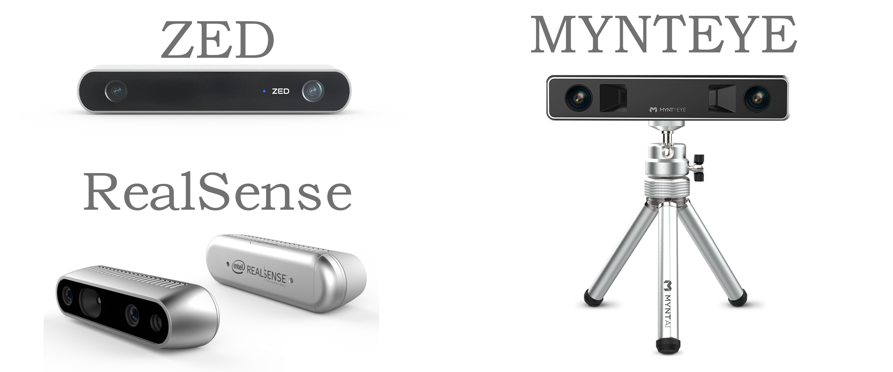
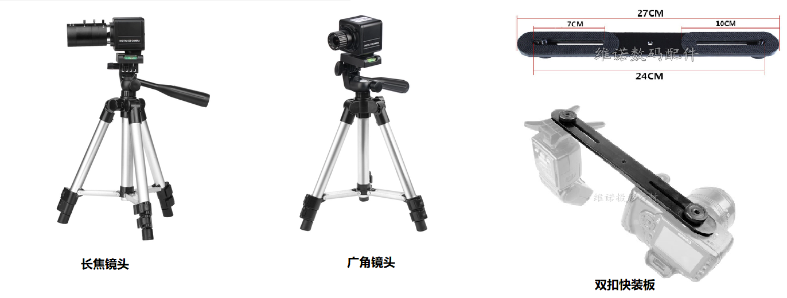

Evision 双目视觉系统

<a href="https://www.bilibili.com/video/av46024738">演示视频</a>

如果您觉得有帮助,请为该项目点star.以便于及时收到最新更新.

## 重要提示:Evision 已迁移至 Qt6 + vcpkg 工具链

> **复活与现代化进行中**:本项目正在借助 AI 工具进行阶段性复活与现代化重构。阶段 0(仓库清理)与阶段 1(让 master 重新可编译、CMake 现代化、内存泄漏修复)已完成;内嵌 Darknet 目标检测模块已整体移除(归档于 `archive/darknet-fork` 分支)。后续阶段将引入深度学习立体匹配等 AI 能力。详见下方"路线图"。

Introduction:
=========
1. 双目系统的标定,畸变校正,视差,三维重建,距离测量等. 
2. ELAS,ADCensus视差算法. 
3. 关于双目的中文资料重复度太高,希望各位后来者能够吸取前人精华,摒弃前人的糟粕,多多自行探索,不要抄来抄去. 
4. 关于程序的BUG,以及其他困惑,请使用issues,或联系邮件jiafeng5513@outlook.com. 
5. Evision使用 cmake-vcpkg 工具链进行编译,开发者使用 Visual Studio 2019+,Qt6,CMake 3.20+. 

资助作者
========

目录
========
- [Introduction:](#introduction)
- [资助作者](#资助作者)
- [目录](#目录)
      - [1.Dependencies](#1dependencies)
      - [2.Directory_specification](#2directory_specification)
      - [3.build](#3build)
      - [4.模块说明](#4模块说明)
      - [5.双目设备](#5双目设备)
      - [6.参考文献](#6参考文献)
      - [7.数据下载](#7数据下载)
      - [8.路线图](#8路线图)

#### 1.路径说明
1. `data`文件夹存储测试用例(大体积数据需从 Release 下载,见下文). 
2. `doc`文件夹中存储的是文档和文档中所用的图片等资源,提供了本项目使用的一些算法相关的论文. 
3. `scripts`文件夹存储编译辅助脚本. 
4. `src`文件夹中存放代码文件. 
* ~~`legacy`~~ 和 ~~`install`~~ 目录已在新一轮清理中移除(旧 C# 版本与编译产物归档于 `archive/legacy-pre-cleanup` 分支). 
* ~~`package`~~ 目录已移除(pthread windows 版改由 vcpkg 管理). 

#### 2.编译基础组件
1. 安装 Visual Studio 2019 或更高版本 + 使用C++的桌面开发工作负载 + 英文语言包.([visual studio Installer](https://visualstudio.microsoft.com/zh-hans/vs/)) 
2. 安装 CMake 3.20+.([Download CMake](https://cmake.org/download/)) 
3. 安装 vcpkg.([GitHub For vcpkg](https://github.com/Microsoft/vcpkg)) 
4. `vcpkg install opencv:x64-windows` 
5. `vcpkg install boost:x64-windows` 
6. `vcpkg install pcl:x64-windows` 
7. `vcpkg install qt6:x64-windows` 
8. `mkdir sln,cd sln` 
9. `cmake ..\src\ -DCMAKE_TOOLCHAIN_FILE="${vcpkg_root}/scripts/buildsystems/vcpkg.cmake" -G"Visual Studio 16 2019" -A x64 -DPointCloudViewer=ON` 
10. 使用 Visual Studio 打开 `Evision.sln`. 
11. 右键 `_CMakeTargets/ALL_BUILD`,生成. 
12. 右键 `EvisionSandBox`,设为启动项目. 
13. 点击"本地Windows调试器",启动程序. 
* 如果vcpkg下载包的速度过慢,可以上代理(以PowerShell为例)`$env:HTTP_PROXY="http://127.0.0.1:1080"`

#### 3.模块说明   
|      |模块名|功能|UI|输出目标|状态|
|:----:|:----:|:----:|:----:|:----:|:----:|
| 1|EvisionADCensus           |ADCensus视差算法  | ×    |动态链接库|✅|
| 2|EvisionElas               |Elas视差算法      | ×    |动态链接库|✅|
| 3|EvisionPnP                |PnP              | ×    |动态链接库|✅|
| 4|EvisionMonocularCalib     |单目标定          | √    |动态链接库|✅|
| 5|EvisionPolyTracker        |单目几何体追踪     | √    |动态链接库|✅|
| 6|EvisionCalibrate          |双目标定          | √    |动态链接库|✅|
| 7|EvisionDisparity          |视差(立体匹配)    |√   |动态链接库|✅|
| 8|EvisionTrace              |交互式测量        | √   |动态链接库|✅|
| 9|EvisionUndistortion       |畸变校正          | √   |动态链接库|✅|  
|10|EvisionCamera             |单目和双目相机功能 | √    |动态链接库|✅|   
|11|EvisionCloudViewer        |三维点云查看      | √    |动态链接库|✅|
|12|EvisionParamBridge        |外部参数传递      | √   |动态链接库|✅|  
|13|EvisionUtils              |通用工具类        | ×   |动态链接库|✅|    
|14|EvisionSandbox            |主程序UI          | √    |可执行程序|✅|

> **EvisionCamera 模块**:已迁移至 Qt6 Multimedia API(`QCameraDevice`/`QImageCapture`/`QMediaCaptureSession`),使用 `QVideoWidget` 替代已移除的 `QCameraViewfinder`。编解码器选择 UI 保留为占位(Qt6 `QImageCapture` 不再暴露编解码器 API)。

#### 4.双目设备
1. 需要注意的是,视差效果,点云效果和精度和设备关系非常大,图片的分辨率越高,光照条件越好,畸变越小,一致性越好,最终效果也就越好.此外,两个相机的距离(基线长度)会影响系统的有效范围,一般来讲,基线越长的双目系统越容易获取远处目标的视差,延长基线能够一定程度上(因为有效距离和相机的焦段也有关)将系统的有效范围拉得更远,但同时,基线越长,盲区(距离相机过近的目标不会同时出现在两个视野中)也越大.
2. 推荐的双目系统:
   1. ZED/RealSense/MYNTEYE小觅相机.这是成熟(昂贵)的商业产品,出厂带有高精度的标定数据和功能强大的SDK,而且还带有IMU,IR主动光学等辅助设备,适合做SLAM,笔者认为购买这类相机是最节约时间成本的方法. 
   
   1. 双目开发板.淘宝上有很多这类产品,价格比ZED那类便宜很多,同时他们带的SDK也要更简陋,有些甚至只支持UVC协议没有SDK,但是他们至少能够控制两侧相机同时拍照,同时基线是固定的,能免去一些麻烦,需要注意的是,这种开发板大多数会输出一张左右视图拼在一起的图片 
   2. 两个工业相机组装.这种方案并不便宜,但是比较自由,可以自己调整基线和光轴指向. 
    
   1. USB相机组装.这是最便宜的方案,只要买两个一样的USB相机,然后想办法把他们固定起来就可以了,但是便宜的USB相机画质比较有限,噪点比较多,而且无法控制两个相机同时拍照,再加上有效距离比较有限,会很大程度上限值效果,此外,由于两个相机固定的不稳定等原因可能出现移动,这会使标定失效,或者由于标定过程中的滑动直接导致标定失败.作者建议,在经济条件允许的情况下,尽量不要采用这种方案 

#### 5.参考文献
1. [相机标定+畸变矫正](https://blog.csdn.net/Loser__Wang/article/details/51811347)
2. [DarkNet](https://github.com/pjreddie/darknet)
3. [DarkNet_Windows](https://github.com/AlexeyAB/darknet)
4. [StdoutRedirector](https://github.com/dbzhang800/StdoutRedirector)
5. [ADCensus论文阅读笔记](https://wenku.baidu.com/view/3708e0554693daef5ff73d4d.html)
6. [ADCensus阅读笔记2](https://www.cnblogs.com/sinbad360/p/7842009.html)
7. [邹宇华CSDN](https://blog.csdn.net/chenyusiyuan/article/details/8131496)
8. [浅墨CSDN](https://blog.csdn.net/poem_qianmo/article/details/19809337)
9. Mei X, Sun X, Zhou M, et al. On building an accurate stereo matching system on graphics hardware[C]//2011 IEEE International Conference on Computer Vision Workshops (ICCV Workshops). IEEE, 2011: 467-474.
10. Geiger, Andreas, Martin Roser, and Raquel Urtasun. "Efficient large-scale stereo matching." Asian conference on computer vision. Springer, Berlin, Heidelberg, 2010.
11. Zhang K, Fang Y, Min D, et al. Cross-scale cost aggregation for stereo matching[C]//Proceedings of the IEEE Conference on Computer Vision and Pattern Recognition. 2014: 1590-1597.
12. Martull, Sarah, Martin Peris, and Kazuhiro Fukui. "Realistic CG stereo image dataset with ground truth disparity maps." ICPR workshop TrakMark2012. Vol. 111. No. 430. 2012.
13. Hirschmuller H. Stereo processing by semiglobal matching and mutual information[J]. IEEE Transactions on pattern analysis and machine intelligence, 2008, 30(2): 328-341.
14. [视差算法](./doc/立体匹配算法.md)
15. [warpped libelas with opencv and used pangolin as GUI](https://github.com/HeYijia/stereo_elas)

#### 6.数据下载
由于体积较大,以下数据已从仓库主分支移除,请按需从 [GitHub Releases](../../releases) 下载并放入对应目录:

| 数据 | 体积 | 用途 | 放置路径 |
|:---:|:---:|:---:|:---:|
| `Simulations/` | ~150 MB | 8 组合成彩虹深度图 + RGB 叠加(测试用) | `data/Simulations/` |
| `Tracker/test_reg/` | ~130 MB | 329 张跟踪配准测试图 | `data/Tracker/test_reg/` |

#### 7.路线图
本项目正借助 AI 工具进行阶段性复活与现代化(完整开发计划见 [doc/开发计划.md](doc/开发计划.md)):

- ✅ **阶段 0 — 仓库清理**:移除 `legacy/`(C# 旧版本)、`install/`(编译产物)、`src/.vs/`、`sln/`、`src/EvisionSandbox/GeneratedFiles/`、`yolov3.weights`、`Simulations/`、`Tracker/test_reg/` 等大体积/无关文件;working tree 从 ~1.2 GB 降至 ~120 MB。旧内容归档于 `archive/legacy-pre-cleanup` 分支。
- ✅ **阶段 1 — 让 master 重新可编译**:CMake 现代化(`target_include_directories`/`target_compile_definitions`/显式源文件列表)、修复 Qt5/Qt6 变量混用、修复明显内存泄漏、修正 `catch(...)` 反模式、新增 GitHub Actions CI 骨架。
- ✅ **阶段 2 — Qt6 完整迁移**:完成 `EvisionCamera` 的 Qt6 Multimedia API 迁移(`QCameraInfo`→`QCameraDevice`、`QCameraImageCapture`→`QImageCapture`、`QCameraViewfinder`→`QVideoWidget`、新增 `QMediaCaptureSession`)、移除 `Qt5Compat` 依赖、SIGNAL/SLOT 字符串宏 → PMF/lambda(144 处)、修复 `EvisionCameraFactory` 导出宏与 `StereoCameraView.ui` 槽名不匹配的预存 bug。
- ✅ **阶段 3 — 目标检测模块移除**:内嵌 Darknet/YOLOv3 目标检测(`EvisionObjDetection` + `EvisionObjDetectionEngine`,约 40K LOC、130 个文件、11 个 CUDA kernel)及 `package/pthread` 已整体移除,不做替换——该模块已完全过时(强制 CUDA/仅 Windows/模型陈旧),归档于 `archive/darknet-fork` 分支。未来如需 AI 检测能力,将基于 ONNX Runtime 等现代方案重新设计,不沿用旧代码。
- 🔨 **阶段 4 — 相机标定优化(进行中)**:新增 Qt-free 共享标定核心 `CalibrationCore`(单/双目模块共用,消除约 350 行重复代码);棋盘格检测升级 `findChessboardCornersSB`;新增 ChArUco 标定板支持(OpenCV 4.7+ objdetect 模块,部分可见即可用);逐视图重投影误差质量门控与离群视图剔除;标定结果(RMS/极线误差/逐视图误差)结构化上报 UI;修复空点集崩溃、内存泄漏等预存 bug。
- 🔜 **阶段 5 — 深度学习立体匹配**:引入 RAFT-Stereo / IGEV-Stereo 作为可选后端,保留 ADCensus/ELAS 作为基线。
- 🔜 **阶段 6 — UI 现代化**:延续作者原计划(EvisionLight),探索 Dear ImGui 路线或继续 Qt6 + Docking 框架。

> **历史方向**:作者曾在原 README 中提到"未来 Evision 会采用 ImgUI 作为界面,不再基于 Qt,以提供更方便的安装体验,并提高运行效率"(`EvisionLight` 计划)。该方向仍作为长期 roadmap 保留,具体路线待阶段 2 完成后评估。

